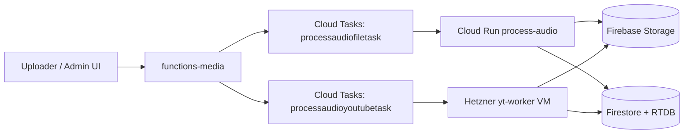
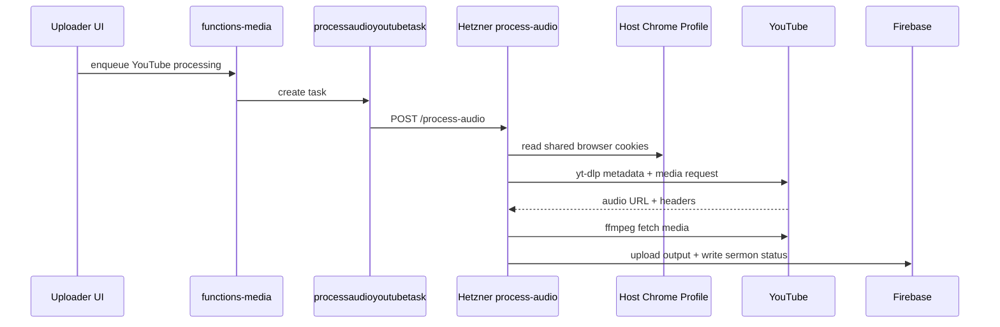
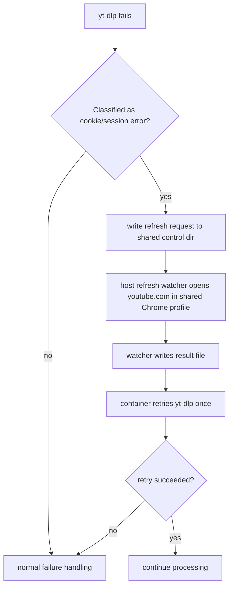

# Process Audio Hetzner VM

This is the operator guide for the split `process-audio` runtime.

The current architecture is intentional:

- normal file uploads are processed on Cloud Run
- YouTube uploads are processed on a dedicated Hetzner VM
- staging and production share the same Hetzner VM, but run in separate containers with separate Firebase env
- both Hetzner containers share one host-native Chrome profile for `yt-dlp --cookies-from-browser`

## High-Level Architecture



## Runtime Split

The queue split is the contract to remember:

- `processaudiofiletask`
  - normal file uploads only
  - stays on Cloud Run `process-audio[-staging]`
- `processaudioyoutubetask`
  - YouTube only
  - goes to `https://yt-worker-staging.upperroommedia.org` or `https://yt-worker.upperroommedia.org`

Code references:

- [functions-media/src/index.ts](/Users/yasaad/Projects/upper-room-media/web-app/functions-media/src/index.ts)
- [functions-media/src/processAudioTask.ts](/Users/yasaad/Projects/upper-room-media/web-app/functions-media/src/processAudioTask.ts)
- [functions-media/src/processAudioService.ts](/Users/yasaad/Projects/upper-room-media/web-app/functions-media/src/processAudioService.ts)
- [apps/process-audio/src/processAudioQueueStore.ts](/Users/yasaad/Projects/upper-room-media/web-app/apps/process-audio/src/processAudioQueueStore.ts)

## Hetzner VM Responsibilities

The VM hosts:

- `process-audio-staging`
- `process-audio-production`
- `caddy`
- `ytdlp-pot-provider`
- a host-native Chrome auth stack under the `ytauth` user

The VM does not host:

- normal file upload processing
- Firebase Functions
- the uploader web app

## YouTube Flow



## Cookie Refresh Retry Flow



This retry is bounded:

- one automatic refresh attempt per request
- one retry after refresh
- then normal failure alerting/defer logic

## Host Layout

Remote stack root:

```text
/opt/upperroom/process-audio-hetzner
```

Important directories:

```text
compose.yaml
Caddyfile
env/
context/
state/
  staging/
    tmp/
    logs/
  production/
    tmp/
    logs/
  caddy/
  shared-browser-profile/
  browser-refresh-control/
```

Important host-native browser paths:

```text
Chrome profile:
/opt/upperroom/process-audio-hetzner/state/shared-browser-profile/.config/google-chrome

Refresh control dir:
/opt/upperroom/process-audio-hetzner/state/browser-refresh-control
```

Container mounts:

```text
/workspace/shared-browser-profile/.config/google-chrome
/workspace/browser-refresh-control
```

## Provisioning Checklist

1. Create a Hetzner Ubuntu VM.
2. Attach:
   - one public IPv4
   - default IPv6
   - SSH keys
3. Open:
   - `22/tcp`
   - `80/tcp`
   - `443/tcp`
4. Install Docker and Compose:

   ```bash
   sudo apt update
   sudo apt install -y docker.io docker-compose-v2 ufw
   sudo systemctl enable --now docker
   sudo usermod -aG docker "$USER"
   sudo mkdir -p /opt/upperroom/process-audio-hetzner
   sudo chown -R "$USER":"$USER" /opt/upperroom/process-audio-hetzner
   sudo ufw allow OpenSSH
   sudo ufw allow 80/tcp
   sudo ufw allow 443/tcp
   sudo ufw enable
   ```

5. Reconnect so the `docker` group is active.

## DNS

Current public hostnames:

- `yt-worker-staging.upperroommedia.org`
- `yt-worker.upperroommedia.org`

Cloudflare should point both at the Hetzner VM. Start with `DNS only`.

## Deploying Hetzner Workers

Set:

```bash
export PROCESS_AUDIO_HETZNER_SSH_TARGET=root@<hetzner-ip-or-host>
export PROCESS_AUDIO_HETZNER_STAGING_HOSTNAME=yt-worker-staging.upperroommedia.org
export PROCESS_AUDIO_HETZNER_PRODUCTION_HOSTNAME=yt-worker.upperroommedia.org
```

Deploy both:

```bash
./scripts/deploy-process-audio-hetzner.sh all
```

Deploy one environment only:

```bash
./scripts/deploy-process-audio-hetzner.sh staging
./scripts/deploy-process-audio-hetzner.sh production
```

What the deploy script does:

1. reads env and secrets from GCP
2. generates one env file per environment
3. assembles a minimal Docker build context
4. `rsync`s the stack to the VM
5. preserves `state/`
6. runs `docker compose up -d --build`

Primary scripts:

- [scripts/prepare-process-audio-hetzner-context.sh](/Users/yasaad/Projects/upper-room-media/web-app/scripts/prepare-process-audio-hetzner-context.sh)
- [scripts/deploy-process-audio-hetzner.sh](/Users/yasaad/Projects/upper-room-media/web-app/scripts/deploy-process-audio-hetzner.sh)
- [scripts/setup-process-audio-hetzner-host-browser-auth.sh](/Users/yasaad/Projects/upper-room-media/web-app/scripts/setup-process-audio-hetzner-host-browser-auth.sh)

## Deploying Cloud Run process-audio

Cloud Run still exists and is still deployed for the non-YouTube path.

Primary workflow/scripts:

- [staging-process-audio-deploy.yml](/Users/yasaad/Projects/upper-room-media/web-app/.github/workflows/staging-process-audio-deploy.yml)
- [main-process-audio-deploy.yml](/Users/yasaad/Projects/upper-room-media/web-app/.github/workflows/main-process-audio-deploy.yml)
- [scripts/deploy-process-audio.sh](/Users/yasaad/Projects/upper-room-media/web-app/scripts/deploy-process-audio.sh)
- [apps/process-audio/cloudbuild.yaml](/Users/yasaad/Projects/upper-room-media/web-app/apps/process-audio/cloudbuild.yaml)

Current expectation:

- Cloud Run deploys should only happen when normal `process-audio` changes require them
- YouTube-specific runtime behavior is owned by Hetzner now

## Verifying a Deployment

Health checks:

```bash
curl -fsS https://yt-worker-staging.upperroommedia.org/healthz
curl -fsS https://yt-worker.upperroommedia.org/healthz
```

Container checks on the VM:

```bash
ssh root@<hetzner-ip> "cd /opt/upperroom/process-audio-hetzner && docker compose ps"
ssh root@<hetzner-ip> "docker logs --tail=200 process-audio-hetzner-process-audio-staging-1"
ssh root@<hetzner-ip> "docker logs --tail=200 process-audio-hetzner-process-audio-production-1"
```

Smoke tests:

```bash
bash scripts/verify-hetzner-ytdlp-smoke.sh staging
bash scripts/verify-hetzner-ytdlp-smoke.sh production
```

## Native Browser Auth

The shared browser auth stack runs on the host, not inside the `process-audio` containers.

Install and configure it:

```bash
./scripts/setup-process-audio-hetzner-host-browser-auth.sh
```

Services started by the host auth stack:

- `process-audio-browser-xvfb.service`
- `process-audio-browser-openbox.service`
- `process-audio-browser-x11vnc.service`
- `process-audio-browser-novnc.service`
- `process-audio-browser-chrome.service`
- `process-audio-browser-refresh.service`
- `process-audio-browser-auth.target`

The services are enabled to come back after reboot.

### Accessing the Browser

Start or verify the auth stack:

```bash
ssh root@<hetzner-ip> "systemctl start process-audio-browser-auth.target"
ssh root@<hetzner-ip> "systemctl status process-audio-browser-auth.target --no-pager"
```

Tunnel noVNC locally:

```bash
ssh -L 3010:127.0.0.1:3010 root@<hetzner-ip>
```

Open:

```text
http://127.0.0.1:3010/vnc.html
```

In the remote desktop:

1. sign into the shared Google account
2. confirm YouTube is signed in
3. verify a target video actually plays

Useful checks:

```bash
ssh root@<hetzner-ip> "systemctl status process-audio-browser-{xvfb,openbox,x11vnc,novnc,chrome,refresh}.service --no-pager"
ssh root@<hetzner-ip> "ss -ltnp | egrep '3010|5900'"
```

## Nightly yt-dlp Updates

GitHub Actions owns the pinned `yt-dlp` version in [apps/process-audio/Dockerfile](/Users/yasaad/Projects/upper-room-media/web-app/apps/process-audio/Dockerfile).

Workflow:

- [nightly-ytdlp-update.yml](/Users/yasaad/Projects/upper-room-media/web-app/.github/workflows/nightly-ytdlp-update.yml)

Behavior:

1. checks the latest stable upstream `yt-dlp`
2. compares against the pinned Dockerfile version
3. updates the Dockerfile if newer
4. commits and pushes the bump to `staging`
5. deploys staging Hetzner
6. runs a remote smoke test
7. deploys production Hetzner only if staging passes

Required GitHub secrets:

- `GCP_WORKLOAD_IDENTITY_PROVIDER`
- `GCP_SERVICE_ACCOUNT_EMAIL`
- `HETZNER_PROCESS_AUDIO_SSH_TARGET`
- `HETZNER_PROCESS_AUDIO_SSH_PRIVATE_KEY`

If the updater needs to be paused, disable the workflow in GitHub Actions rather than changing the VM by hand.

## Runtime Defaults

Important Hetzner defaults:

- `YOUTUBE_BROWSER_FALLBACK_ENABLED=true`
- `YOUTUBE_BROWSER_FALLBACK_URL=`
- `YOUTUBE_FINAL_BROWSER_FALLBACK_URL=`
- `YOUTUBE_FORCE_IPV4=false`
- `YTDLP_POT_PROVIDER_BASE_URL=http://ytdlp-pot-provider:4416`

This is intentional:

- Cloud Run stays simple for normal file uploads
- Hetzner owns the `yt-dlp` + `ffmpeg` + shared browser-cookie YouTube path

## Failure Handling

Expected failure behavior:

- operational alerts still flow through Firebase mail queue documents
- Hetzner failures include runtime metadata
- classified cookie/session failures trigger one browser refresh attempt before final failure handling

If something fails, check in this order:

1. worker health endpoint
2. `docker compose ps`
3. host browser auth services
4. shared Chrome profile presence
5. `yt-dlp` smoke test
6. Firebase writes and alert queue state

## Operator Notes

Important invariants:

- do not move normal file processing onto Hetzner
- do not move YouTube back onto Cloud Run without a deliberate architecture change
- do not let deploys wipe `state/`
- staging and production may share one VM, but they must keep separate Firebase env and separate app containers
- the shared Chrome profile is one profile on the host, not one profile per container
