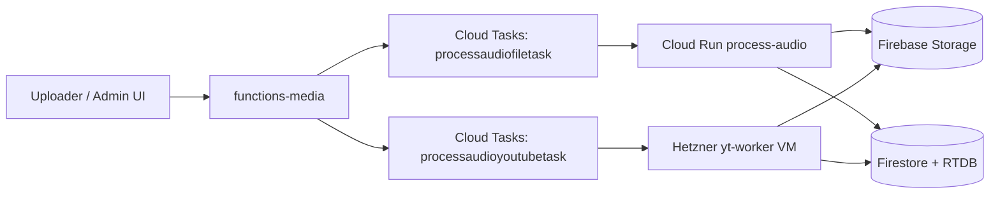
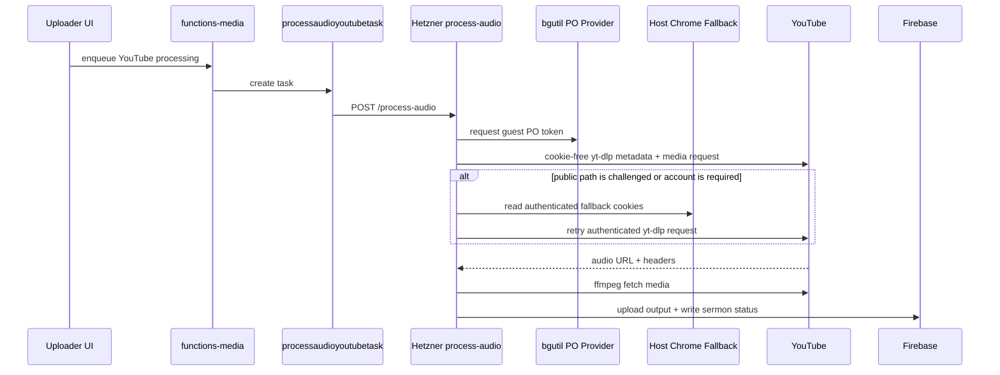
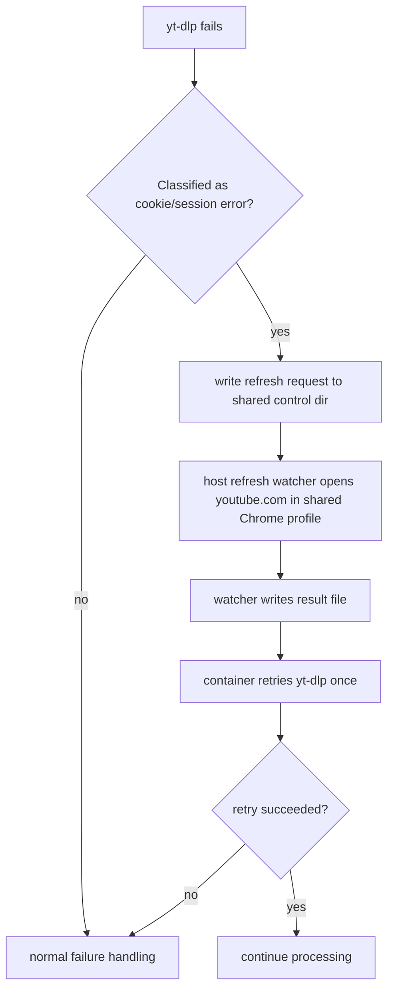

# Process Audio Hetzner VM

This is the operator guide for the split `process-audio` runtime.

The current architecture is intentional:

- normal file uploads are processed on Cloud Run
- YouTube uploads are processed on a dedicated Hetzner VM
- staging and production share the same Hetzner VM, but run in separate containers with separate Firebase env
- public videos use cookie-free yt-dlp extraction first
- both Hetzner containers retain one host-native Chrome profile for classified authenticated fallback

Whenever Upper Room owns the original recording, direct file/object-storage ingestion is the preferred source. YouTube download is a compatibility path, not the canonical media store.

## High-Level Architecture



## Runtime Split

The queue split is the contract to remember:

- `processaudiofiletask`
  - normal file uploads only
  - stays on Cloud Run `process-audio[-staging]`
- `processaudioyoutubetask`
  - YouTube only
  - goes to `https://yt-worker-staging.upperroommedia.org` or `https://yt-worker.upperroommedia.org`

Code references:

- [functions-media/src/index.ts](/Users/yasaad/Projects/upper-room-media/web-app/functions-media/src/index.ts)
- [functions-media/src/processAudioTask.ts](/Users/yasaad/Projects/upper-room-media/web-app/functions-media/src/processAudioTask.ts)
- [functions-media/src/processAudioService.ts](/Users/yasaad/Projects/upper-room-media/web-app/functions-media/src/processAudioService.ts)
- [apps/process-audio/src/processAudioQueueStore.ts](/Users/yasaad/Projects/upper-room-media/web-app/apps/process-audio/src/processAudioQueueStore.ts)

## Hetzner VM Responsibilities

The VM hosts:

- `process-audio-staging`
- `process-audio-production`
- `caddy`
- `ytdlp-pot-provider-staging`
- `ytdlp-pot-provider-production`
- a host-native Chrome auth stack under the `ytauth` user
- Sentry-enabled `process-audio` containers for both environments

The worker images include pinned versions of:

- `yt-dlp` `2026.08.19`
- `bgutil-ytdlp-pot-provider` `1.3.2`
- `ffmpeg`
- `aria2c`

The release contract in `media-runtime-versions.env` is the source of truth for the yt-dlp, ffmpeg, Deno, and bgutil versions and the provider image digest. The Dockerfile defaults are kept as buildable documentation, but deploy refuses any drift from the contract. The provider plugin and the two environment-specific provider services use the same release. Staging and production do not share a provider container or provider network.

## Known-Good Livestream Fix

Known-good production release for completed YouTube livestream downloads:

- `process-audio-hetzner@production-c6d37e55b15de384c6ada0fbd6c58bd9b5a6f0b6`

Why this matters:

- on Hetzner, yt-dlp's native `m3u8` downloader could intermittently fail mid-stream with fragment temp-file errors like:
  - `Unable to rename file ... part-FragNNN.part`
  - `FileNotFoundError ... part-FragNNN`
- this affected completed livestream URLs routed through `formatId=91` / `selectedProtocol=m3u8_native`
- the known-good fix forces `--downloader m3u8:ffmpeg` for YouTube `m3u8` paths while leaving direct `https` downloads on the existing path
- benchmarked follow-up tuning on the deployed production image showed the best stable throughput with:
  - `YTDLP_M3U8_FFMPEG_DOWNLOADER_ARGS=-reconnect 1 -reconnect_streamed 1 -reconnect_on_network_error 1 -reconnect_on_http_error 4xx,5xx -reconnect_delay_max 5 -http_persistent 1 -http_multiple 1`
- on the exact `KP3zAP3GE0g` livestream URL, that tuned `ffmpeg` path outperformed the plain `m3u8:ffmpeg` baseline during 45-second live-container probes on Hetzner

If livestream downloads regress in the future, compare behavior against commit `c6d37e55` first before changing format selection again.

The VM does not host:

- normal file upload processing
- Firebase Functions
- the uploader web app

## IAM Prerequisites

The Firebase service account stored in `PROCESS_AUDIO_FIREBASE_SERVICE_ACCOUNT_JSON` must have both of these project-level roles in its own environment:

- `roles/cloudtasks.enqueuer`
- `roles/cloudtasks.viewer`

Apply the pair independently in `urm-app-staging` and `urm-app`; do not assume a production binding covers staging. The worker needs `cloudtasks.enqueuer` to enqueue retries and deferred work. It also needs `cloudtasks.viewer` to inspect the live task after Cloud Tasks returns HTTP 409, so it can distinguish the precise "same task already exists" condition from an unsafe conflict before treating enqueue as successful.

Resolve the service-account emails from the existing secrets, then verify both roles:

```bash
export STAGING_PROCESS_AUDIO_SERVICE_ACCOUNT="$(
  gcloud secrets versions access latest \
    --secret=PROCESS_AUDIO_FIREBASE_SERVICE_ACCOUNT_JSON \
    --project=urm-app-staging \
  | python3 -c 'import json, sys; print(json.load(sys.stdin)["client_email"])'
)"
export PRODUCTION_PROCESS_AUDIO_SERVICE_ACCOUNT="$(
  gcloud secrets versions access latest \
    --secret=PROCESS_AUDIO_FIREBASE_SERVICE_ACCOUNT_JSON \
    --project=urm-app \
  | python3 -c 'import json, sys; print(json.load(sys.stdin)["client_email"])'
)"

for environment in \
  "urm-app-staging:${STAGING_PROCESS_AUDIO_SERVICE_ACCOUNT}" \
  "urm-app:${PRODUCTION_PROCESS_AUDIO_SERVICE_ACCOUNT}"; do
  project_id="${environment%%:*}"
  service_account="${environment#*:}"
  for role in roles/cloudtasks.enqueuer roles/cloudtasks.viewer; do
    binding="$(
      gcloud projects get-iam-policy "$project_id" \
        --flatten='bindings[].members' \
        --filter="bindings.role=${role} AND bindings.members=serviceAccount:${service_account}" \
        --format='value(bindings.role)'
    )"
    [[ "$binding" == "$role" ]] || {
      echo "Missing ${role} for ${service_account} in ${project_id}" >&2
      exit 1
    }
    echo "Verified ${project_id}: ${service_account} has ${role}"
  done
done
```

## YouTube Flow



## Cookie Refresh Retry Flow



This retry is bounded:

- one automatic refresh attempt per request
- one retry after refresh
- then normal failure alerting/defer logic

## Cookie Source

Hetzner does not use RTDB cookie blobs anymore.

The only supported YouTube cookie source on the VM is the shared host Chrome profile:

- host path:
  - `/opt/upperroom/process-audio-hetzner/state/shared-browser-profile/.config/google-chrome`
- container path:
  - `/workspace/shared-browser-profile/.config/google-chrome`

`yt-dlp` reads that profile with `--cookies-from-browser`.

## Host Layout

Remote stack root:

```text
/opt/upperroom/process-audio-hetzner
```

Important directories:

```text
compose.yaml
Caddyfile
env/
context/
state/
  staging/
    tmp/
    logs/
  production/
    tmp/
    logs/
  caddy/
  shared-browser-profile/
  browser-refresh-control/
```

Important host-native browser paths:

```text
Chrome profile:
/opt/upperroom/process-audio-hetzner/state/shared-browser-profile/.config/google-chrome

Refresh control dir:
/opt/upperroom/process-audio-hetzner/state/browser-refresh-control
```

Container mounts:

```text
/workspace/shared-browser-profile/.config/google-chrome
/workspace/browser-refresh-control
```

## Provisioning Checklist

1. Create a Hetzner Ubuntu VM.
2. Attach:
   - one public IPv4
   - default IPv6
   - SSH keys
3. Open:
   - `22/tcp`
   - `80/tcp`
   - `443/tcp`
4. Install Docker and Compose:

   ```bash
   sudo apt update
   sudo apt install -y docker.io docker-compose-v2 ufw
   sudo systemctl enable --now docker
   sudo usermod -aG docker "$USER"
   sudo mkdir -p /opt/upperroom/process-audio-hetzner
   sudo chown -R "$USER":"$USER" /opt/upperroom/process-audio-hetzner
   sudo ufw allow OpenSSH
   sudo ufw allow 80/tcp
   sudo ufw allow 443/tcp
   sudo ufw enable
   ```

5. Reconnect so the `docker` group is active.

## DNS

Current public hostnames:

- `yt-worker-staging.upperroommedia.org`
- `yt-worker.upperroommedia.org`

Cloudflare should point both at the Hetzner VM. Start with `DNS only`.

## Deploying Hetzner Workers

Set:

```bash
export PROCESS_AUDIO_HETZNER_SSH_TARGET=root@<hetzner-ip-or-host>
export PROCESS_AUDIO_HETZNER_STAGING_HOSTNAME=yt-worker-staging.upperroommedia.org
export PROCESS_AUDIO_HETZNER_PRODUCTION_HOSTNAME=yt-worker.upperroommedia.org
export PROCESS_AUDIO_HETZNER_PUBLIC_SMOKE_YOUTUBE_URL='https://www.youtube.com/watch?v=<owned-public-canary>'
export PROCESS_AUDIO_HETZNER_AUTH_SMOKE_YOUTUBE_URL='https://www.youtube.com/watch?v=<owned-account-visible-canary>'
```

Deploy both:

```bash
./scripts/deploy-process-audio-hetzner.sh all
```

Deploy one environment only:

```bash
./scripts/deploy-process-audio-hetzner.sh staging
./scripts/deploy-process-audio-hetzner.sh production
```

What the deploy script does:

1. reads env and secrets from GCP
2. generates one env file per environment
3. assembles a minimal Docker build context
4. acquires a deployment lock with owner metadata and a one-hour renewable lease
5. snapshots the exact active Compose file, root `.env`, both worker env files, Caddyfile, version contract, README, build context, and running worker image IDs before any active file is overwritten
6. uploads the prepared release into a deployment-specific incoming directory, then atomically activates its configuration and build context
7. starts and health-checks the environment-specific pinned PO-token provider
8. hashes the complete prepared local Docker context plus the release contract and uses that SHA-256 as the candidate identity
9. builds that candidate once in staging while the current worker remains available
10. records the candidate's immutable Docker image ID and marks it validated only after staging health and media canaries pass
11. promotes that exact recorded image ID to production with `--no-build`; production refuses an absent, unvalidated, or digest-mismatched candidate
12. waits for each replacement worker's `/healthz`
13. requires both bounded media canaries to report their byte results to the loopback-only diagnostics endpoint and requires `/readyz` to pass
14. restores the exact pre-rollout configuration first, then recreates and health-checks each previous worker image if replacement health, browser readiness, a provider probe, either canary, or readiness fails

`all` is a sequential promotion transaction: staging is replaced and validated first, then production receives the same image ID. A standalone `production` deploy never builds; it must run from the same prepared source context as the successful staging deploy so it resolves the already-validated candidate under `state/deploy-candidates/<context-sha256>/`. This also works for an unpushed local branch because candidate identity comes from source content, not the Git branch or commit name.

The deployment lock remains owned through configuration activation, worker health, browser readiness, staging validation, production promotion, and all canaries. A second deployment cannot enter between replacement and a possible rollback. If the initiating process disappears, the lease makes the lock recoverable: a later deployment detects the expired owner, completes that transaction's normal config-and-image rollback, and only then acquires a new transaction. A live, unexpired owner is never preempted.

Rollback restores the exact pre-rollout Compose/environment configuration and build context before recreating any environment-specific worker container. It does not delete or rewrite provider/browser data, browser profiles, control directories, logs, or media-processing state. A failed deploy always exits nonzero even when rollback succeeds. If rollback itself fails, its deployment-specific metadata and lock remain for operator recovery; successful deployments remove their temporary rollback tag, incoming release, and metadata only after all canaries pass.

The transaction also snapshots the prior image identity and running state of each affected PO-token provider and Caddy. Any service whose mutation was attempted is recreated from the pre-rollout Compose/Caddy configuration and exact prior image before rollback can succeed, including a provider failure that occurs before worker replacement begins.

The deploy refuses to replace an environment that has no running worker image to preserve. Bootstrap deployments therefore require a separately reviewed initialization procedure; the normal rollout path never silently gives up rollback protection.

Primary scripts:

- [scripts/prepare-process-audio-hetzner-context.sh](/Users/yasaad/Projects/upper-room-media/web-app/scripts/prepare-process-audio-hetzner-context.sh)
- [scripts/deploy-process-audio-hetzner.sh](/Users/yasaad/Projects/upper-room-media/web-app/scripts/deploy-process-audio-hetzner.sh)
- [scripts/setup-process-audio-hetzner-host-browser-auth.sh](/Users/yasaad/Projects/upper-room-media/web-app/scripts/setup-process-audio-hetzner-host-browser-auth.sh)

### Sentry Configuration

Hetzner `process-audio` reports to Sentry project `process-audio-hetzner` in org `upper-room-media`.

Secrets read during deploy:

- `PROCESS_AUDIO_FIREBASE_SERVICE_ACCOUNT_JSON`
- `RUNTIME_ALERT_RECIPIENTS`
- `PROCESS_AUDIO_SENTRY_DSN`

Sentry env injected by deploy:

- `SENTRY_DSN`
- `SENTRY_ENVIRONMENT=staging|production`
- `SENTRY_RELEASE=process-audio-hetzner@<staging|production>-<git sha>`
- `SENTRY_TRACES_SAMPLE_RATE=0.1`
- `SENTRY_ENABLE_LOGS=true`
- `SENTRY_LOG_LEVELS=info,warn,error`

Operational observability defaults:

- request traces stay enabled at `SENTRY_TRACES_SAMPLE_RATE=0.1`
- manual spans cover the end-to-end sermon run, media download/transcode, and intro/outro merge stages
- Winston forwards structured `info`, `warn`, and `error` logs into Sentry Logs by default so request lifecycle, format selection, and yt-dlp stall diagnostics are visible without SSH

## Deploying Cloud Run process-audio

Cloud Run still exists and is still deployed for the non-YouTube path.

Primary workflow/scripts:

- [staging-process-audio-deploy.yml](/Users/yasaad/Projects/upper-room-media/web-app/.github/workflows/staging-process-audio-deploy.yml)
- [main-process-audio-deploy.yml](/Users/yasaad/Projects/upper-room-media/web-app/.github/workflows/main-process-audio-deploy.yml)
- [scripts/deploy-process-audio.sh](/Users/yasaad/Projects/upper-room-media/web-app/scripts/deploy-process-audio.sh)
- [apps/process-audio/cloudbuild.yaml](/Users/yasaad/Projects/upper-room-media/web-app/apps/process-audio/cloudbuild.yaml)

Current expectation:

- Cloud Run deploys should only happen when normal `process-audio` changes require them
- YouTube-specific runtime behavior is owned by Hetzner now

## Verifying a Deployment

Health checks:

```bash
curl -fsS https://yt-worker-staging.upperroommedia.org/healthz
curl -fsS https://yt-worker.upperroommedia.org/healthz
```

Sentry checks:

```bash
curl -fsS https://yt-worker-staging.upperroommedia.org/healthz | jq '.sentryEnabled, .sentryEnvironment, .sentryRelease, .sentryLogsEnabled, .sentryLogLevels, .sentryTracesSampleRate'
curl -fsS https://yt-worker.upperroommedia.org/healthz | jq '.sentryEnabled, .sentryEnvironment, .sentryRelease, .sentryLogsEnabled, .sentryLogLevels, .sentryTracesSampleRate'
```

Container checks on the VM:

```bash
ssh root@<hetzner-ip> "cd /opt/upperroom/process-audio-hetzner && docker compose ps"
ssh root@<hetzner-ip> "docker logs --tail=200 process-audio-hetzner-process-audio-staging-1"
ssh root@<hetzner-ip> "docker logs --tail=200 process-audio-hetzner-process-audio-production-1"
ssh root@<hetzner-ip> "docker exec process-audio-hetzner-process-audio-staging-1 /bin/sh -lc 'env | grep -E \"^SENTRY_|^PROCESS_AUDIO_RUNTIME_(ENV|HOST|PROFILE)=\" | sort'"
ssh root@<hetzner-ip> "docker exec process-audio-hetzner-process-audio-production-1 /bin/sh -lc 'env | grep -E \"^SENTRY_|^PROCESS_AUDIO_RUNTIME_(ENV|HOST|PROFILE)=\" | sort'"
```

Version checks:

```bash
ssh root@<hetzner-ip> "docker exec process-audio-hetzner-process-audio-staging-1 yt-dlp --version"
ssh root@<hetzner-ip> "docker exec process-audio-hetzner-process-audio-staging-1 ffmpeg -version | head -n 1"
ssh root@<hetzner-ip> "docker exec process-audio-hetzner-process-audio-staging-1 aria2c --version | head -n 1"
```

Smoke tests:

```bash
export PROCESS_AUDIO_HETZNER_PUBLIC_SMOKE_YOUTUBE_URL='https://www.youtube.com/watch?v=<owned-public-canary>'
export PROCESS_AUDIO_HETZNER_AUTH_SMOKE_YOUTUBE_URL='https://www.youtube.com/watch?v=<owned-account-visible-canary>'
bash scripts/verify-hetzner-ytdlp-smoke.sh staging
bash scripts/verify-hetzner-ytdlp-smoke.sh production
```

Both canaries are required deployment inputs and must be stable, short, Upper Room-controlled videos. The public canary always attempts the cookie-free guest path first. A guest media download passes immediately; only a recognized YouTube anti-bot, login-required, or page-reload response may transition to authenticated fallback, which must then download valid media bytes. HTTP 429 is classified as `rate_limited` and fails the deploy instead of spending an authenticated request. Any other guest error also fails the deploy. The account-visible canary must succeed directly through the shared Chrome profile.

Each successful media path downloads only the opening section (8 seconds by default), asserts the versions in `media-runtime-versions.env`, the pinned provider image, the expected credential mode, and a decodable bounded artifact through `ffprobe`. It also calls the provider's `/ping` endpoint from inside the worker, records the exact guest/authenticated byte-canary result through `POST /internal/youtube-canary`, and finally gates deployment on `/readyz`. Configure `PROCESS_AUDIO_HETZNER_SMOKE_SECTION_SECONDS` from 2 through 30 to change the bound.

A passing `/healthz` is not sufficient. The smoke also requires the environment-specific provider to be healthy and the full browser auth stack, including `process-audio-browser-pot.service`, to be active. It intentionally does not refresh or mutate the browser session before testing it.

Generated `env/process-audio-<environment>.env` files contain service-account and observability secrets and must remain owned by the deployment account with mode `0600`. Inside each worker, `/workspace/logs/firebase-service-account.json` is atomically replaced at startup, owned by the unprivileged worker user, and mode `0600`. The smoke gate verifies both modes and the in-container owner; do not loosen them to troubleshoot access.

`yt-dlp-getpot-wpc` 1.1.2 is intentionally not installed. Its stock provider launches its own non-headless local Chrome with a new writable temporary profile, does not expose an attach-to-existing-browser or shared-profile option, and clears browser cookies during launch. The worker currently has neither a local Chrome/display stack nor permission to mutate the host's read-only signed-in profile. Using it against that profile would also conflict with Chrome's single-profile locking and risk erasing the authenticated fallback. Evaluate WPC only as an isolated worker/provider with its own Chrome, Xvfb, writable ephemeral profile, and media-byte canaries; do not point it at the shared authenticated profile.

Optional Sentry smoke from a live container:

```bash
ssh root@<hetzner-ip> "docker exec -i process-audio-hetzner-process-audio-staging-1 /bin/sh -lc 'cd /workspace/apps/process-audio && node'" <<'NODE'
const { Sentry } = require('./dist/instrument.js');
Sentry.captureMessage('staging process-audio sentry smoke', 'info');
Sentry.close(2000).then((ok) => process.exit(ok ? 0 : 1));
NODE
```

Ignore the resulting synthetic issue in Sentry after verification.

## Native Browser Auth

The shared browser auth stack runs on the host, not inside the `process-audio` containers.

Install and configure it:

```bash
./scripts/setup-process-audio-hetzner-host-browser-auth.sh
```

Services started by the host auth stack:

- `process-audio-browser-xvfb.service`
- `process-audio-browser-openbox.service`
- `process-audio-browser-x11vnc.service`
- `process-audio-browser-novnc.service`
- `process-audio-browser-chrome.service`
- `process-audio-browser-refresh.service`
- `process-audio-browser-pot.service` mints a fresh, video-bound GVS PO token in
  the authenticated Chrome session when cookie-backed yt-dlp receives a media 403.
  It is deliberately file-brokered through the existing control volume; DevTools
  remains loopback-only and is never exposed to containers or the public network.
- `process-audio-browser-auth.target`

The auth target is expected to be enabled under `multi-user.target` so the full stack comes back after reboot.

### Accessing the Browser

Start or verify the auth stack:

```bash
ssh root@<hetzner-ip> "systemctl start process-audio-browser-auth.target"
ssh root@<hetzner-ip> "systemctl status process-audio-browser-auth.target --no-pager"
```

Tunnel noVNC locally:

```bash
ssh -L 3010:127.0.0.1:3010 root@<hetzner-ip>
```

Open:

```text
http://127.0.0.1:3010/vnc.html
```

In the remote desktop:

1. sign into the shared Google account
2. confirm YouTube is signed in
3. verify a target video actually plays

Useful checks:

```bash
ssh root@<hetzner-ip> "systemctl status process-audio-browser-{xvfb,openbox,x11vnc,novnc,chrome,refresh,pot}.service --no-pager"
ssh root@<hetzner-ip> "ss -ltnp | egrep '3010|5900'"
```

## Monitoring Download Speed

To determine whether a slow request is network-bound or CPU-bound, watch the staging worker logs:

```bash
ssh root@<hetzner-ip> "docker logs -f process-audio-hetzner-process-audio-staging-1"
```

The key lines are:

- `Processing progress`
  - includes `ffmpegSpeed` and `ffmpegBitrate`
  - best signal for direct URL plus `ffmpeg` fetch/transcode runs
- `Download progress`
  - yt-dlp-side progress for file-based download paths
- `FFmpeg command`
  - confirms which acquisition path the request took

Interpretation:

- low `ffmpegSpeed` with hot CPU usually means `ffmpeg` filtering/transcoding is the bottleneck
- low `Download progress` or weak yt-dlp transfer rates suggests the downloader side is the bottleneck
- `aria2c` is available for yt-dlp-managed file download paths such as section-download fallback, but it does not speed up the direct URL plus `ffmpeg` path by itself

## Nightly Media Tool Updates

The repository-owned release contract is [media-runtime-versions.env](/Users/yasaad/Projects/upper-room-media/web-app/ops/process-audio-hetzner/media-runtime-versions.env). Deploy, Compose, smoke expectations, and the nightly updater consume it; the updater also keeps Dockerfile defaults and development Compose files synchronized in the same pull-request change.

Workflow:

- [nightly-ytdlp-update.yml](/Users/yasaad/Projects/upper-room-media/web-app/.github/workflows/nightly-ytdlp-update.yml)

Behavior:

1. checks the latest upstream media-runtime versions
2. atomically updates the release contract, Dockerfile defaults, provider digest references, and smoke expectations on `automation/media-tool-update`
3. opens or refreshes a pull request targeting `staging`
4. relies on normal review and deployment workflows to validate staging
5. requires a separate reviewed promotion to `main` before production deploys

The updater does not automatically promote an artifact to production. A green updater run only means the update PR was created or refreshed; operators must not interpret it as proof that the new media bundle passed the byte-download canaries.

Required GitHub secrets:

- `GCP_WORKLOAD_IDENTITY_PROVIDER`
- `GCP_SERVICE_ACCOUNT_EMAIL`
- `HETZNER_PROCESS_AUDIO_SSH_TARGET`
- `HETZNER_PROCESS_AUDIO_SSH_PRIVATE_KEY`

Required deployment-canary variables (pass them to the deployment workflow step; deploy runs and finalizes the canaries transactionally):

- `PROCESS_AUDIO_HETZNER_PUBLIC_SMOKE_YOUTUBE_URL`
- `PROCESS_AUDIO_HETZNER_AUTH_SMOKE_YOUTUBE_URL`

The deploy also injects the public and account-visible URLs into the corresponding worker as sensitive operational configuration under `PROCESS_AUDIO_YOUTUBE_GUEST_CANARY_URL` and `PROCESS_AUDIO_YOUTUBE_AUTH_CANARY_URL`; deploy and runtime logs must never print either full URL. The worker runs non-overlapping guest and authenticated byte canaries at startup and every `PROCESS_AUDIO_YOUTUBE_AUTH_CANARY_INTERVAL_MS=600000` (10 minutes). Readiness accepts media-byte evidence for at most `PROCESS_AUDIO_YOUTUBE_MEDIA_CANARY_MAX_AGE_MS=900000` (15 minutes). Keep the interval below the max age so one transient run has bounded recovery time without making healthy evidence permanently fresh.

If the updater needs to be paused, disable the workflow in GitHub Actions rather than changing the VM by hand.

## Runtime Defaults

Important Hetzner defaults:

- `YOUTUBE_BROWSER_FALLBACK_ENABLED=true`
- `YOUTUBE_BROWSER_FALLBACK_URL=`
- `YOUTUBE_FINAL_BROWSER_FALLBACK_URL=`
- `YOUTUBE_FORCE_IPV4=false`
- `YTDLP_USE_COOKIES_FOR_PUBLIC_VIDEOS=false`
- `YTDLP_POT_PROVIDER_BASE_URL=http://ytdlp-pot-provider-<environment>:4416`

This is intentional:

- Cloud Run stays simple for normal file uploads
- Hetzner owns the guest-first `yt-dlp` + `ffmpeg` path
- the shared browser session remains an authenticated fallback, not a prerequisite for public extraction

## Failure Handling

Expected failure behavior:

- operational alerts still flow through Firebase mail queue documents
- Hetzner failures include runtime metadata
- classified cookie/session failures trigger one browser refresh attempt before final failure handling

If something fails, check in this order:

1. worker health endpoint
2. `docker compose ps`
3. host browser auth services
4. shared Chrome profile presence
5. `yt-dlp` smoke test
6. Firebase writes and alert queue state

## Operator Notes

Important invariants:

- do not move normal file processing onto Hetzner
- do not move YouTube back onto Cloud Run without a deliberate architecture change
- do not let deploys wipe `state/`
- staging and production may share one VM, but they must keep separate Firebase env and separate app containers
- the shared Chrome profile is one profile on the host, not one profile per container
